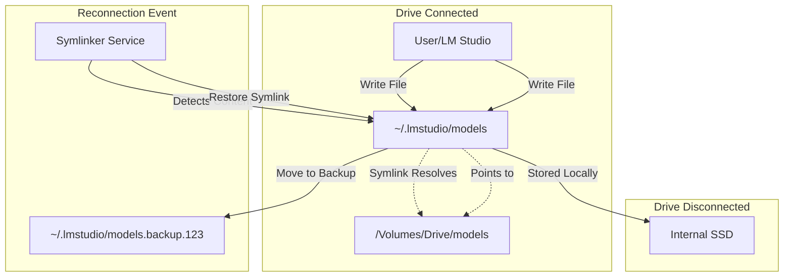

# Architecture

## Overview
LM Studio Symlinker manages the storage of LM Studio models and hub data by replacing the local configuration directories with symbolic links pointing to an external drive.

## Core Mechanism: Directory Symlinking
The application does **not** rely on file-watching or background copying for normal operation. Instead, it utilizes file system symbolic links (symlinks) at the directory level.

### 1. Initialization
When you click "Initialize":
1. The app moves the existing contents of `~/.lmstudio/models` to `/Volumes/ExternalDrive/models`.
2. It deletes `~/.lmstudio/models`.
3. It creates a symlink: `~/.lmstudio/models` -> `/Volumes/ExternalDrive/models`.

### 2. Normal Operation (Drive Connected)
- **Reading:** LM Studio reads `~/.lmstudio/models/...`. The OS redirects this request transparently to `/Volumes/ExternalDrive/models/...`.
- **Writing (Downloading):** When LM Studio downloads a new model, it writes to `~/.lmstudio/models/...`. The OS writes the bits directly to the external drive.
    - **No Background Copying:** There is no delay or background process. The data lands on the external drive immediately.
    - **No Internal Storage Used:** The model data never touches your internal drive.

### 3. Drive Disconnected
The system service (LaunchAgent) monitors `/Volumes` for unmount events.
- When the drive is unplugged, the symlink is broken.
- The app/service removes the broken symlink and creates an empty directory at `~/.lmstudio/models` to prevent LM Studio from crashing or showing errors.
- **Offline Writes:** If you download a model while the drive is disconnected, it is saved to this internal directory.

### 4. Drive Reconnected
When the drive is plugged back in:
1. The app detects the volume mount.
2. **Conflict Resolution:** It checks `~/.lmstudio/models`.
    - If it contains files (downloaded while offline), the app **moves** this directory to `~/.lmstudio/models.backup.<timestamp>`.
    - **Note:** It does *not* merge these files to the external drive automatically.
3. It re-creates the symlink to `/Volumes/ExternalDrive/models`.
4. LM Studio now sees the external content again.

## Component Structure

### LMStudioSymlinker (App)
- SwiftUI frontend for configuration and setup.
- Manages the initial data migration.

### System Service (LaunchAgents)
Background scripts installed to `~/Library/LaunchAgents` to automate symlink management without the GUI app running.
- `com.lmstudio.symlinker.disk-watch`: Monitors drive mount/unmount events.
- `com.lmstudio.symlinker.login`: Checks state at login.

### Data Flow Diagram

