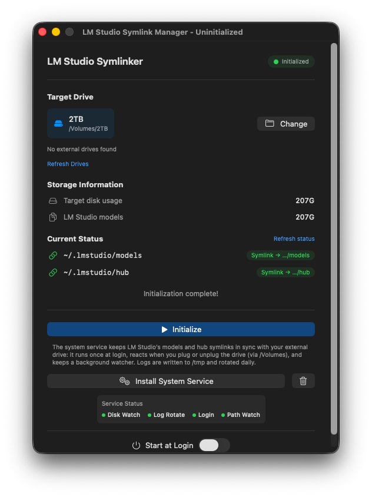

# LM Studio Symlinker



A macOS menu bar app that keeps [LM Studio](https://lmstudio.ai/) models and hub data on an external drive by symlinking `~/.lmstudio/models` and `~/.lmstudio/hub` to the drive. When the drive is disconnected, the app removes the symlinks so LM Studio doesn’t break; when you plug it back in, it restores them automatically.

## Features

- **Drive selection** — Choose an external volume to store LM Studio models and hub data
- **One-time setup** — Initialize: copy or move existing data to the drive and create symlinks from `~/.lmstudio/models` and `~/.lmstudio/hub` to the drive
- **Volume monitoring** — Detects when the selected drive is mounted or unmounted and updates symlinks so LM Studio keeps working
- **Launch at login** — Optional launch agent so the app runs in the background and restores symlinks after reboot
- **Menu bar only** — Runs from the system tray (link icon); Settings and Quit are in the menu

## Requirements

- **macOS 15** (Sequoia) or later
- **Swift 6** (for building from source)

## Build & Run

```zsh
# Clone and enter the project
cd LMStudioSymlinker

# Build
swift build

# Run
swift run LMStudioSymlinker
```

The built executable is at `.build/debug/LMStudioSymlinker`. You can copy it to `/Applications` or another folder and run it from there.

## Build on Ubuntu / Linux

On Linux only the **CLI** is available (the menu bar app is macOS-only). Use Swift 6.x (e.g. from [swift.org](https://swift.org/download/) or your distro).

```bash
# From the project root (where Package.swift is)
cd LMStudioSymlinker

# Debug build
swift build --product LMStudioSymlinkerCLI

# Release build
swift build -c release --product LMStudioSymlinkerCLI
```

- **Debug binary:** `.build/debug/LMStudioSymlinkerCLI`
- **Release binary:** `.build/release/LMStudioSymlinkerCLI`

Run with: `./.build/debug/LMStudioSymlinkerCLI` or `./.build/release/LMStudioSymlinkerCLI`.

You must pass `--product LMStudioSymlinkerCLI` because the default `swift build` would try to build the macOS app, which fails on Linux (SwiftUI/AppKit and macOS-only dependencies).

## Creating a .app for distribution (e.g. GitHub)

1. **Build the app bundle** (release binary + macOS app structure):

   ```zsh
   ./scripts/build-app.sh
   ```

   This produces `build/LMStudioSymlinker.app`.

2. **Zip it for upload** (e.g. to a GitHub Release):

   ```zsh
   cd build && zip -r LMStudioSymlinker-macOS.zip LMStudioSymlinker.app && cd ..
   ```

   Upload `build/LMStudioSymlinker-macOS.zip` as a release asset.

3. **Create a GitHub Release**:

   - Repo → **Releases** → **Draft a new release**
   - Choose a tag (e.g. `v1.0.0`) and title
   - Add release notes, then attach `LMStudioSymlinker-macOS.zip`
   - Publish

Users can download the zip, unzip it, and drag `LM Studio Symlinker.app` into Applications (or run it from the folder). On first launch, macOS may show “unidentified developer”; they can open via **Right‑click → Open** or **System Settings → Privacy & Security → Open anyway**.

**Optional (Apple Developer account):** To avoid the “unidentified developer” prompt, code-sign and notarize the app before zipping (e.g. `codesign` and `xcrun notarytool`). See [Apple’s notarization docs](https://developer.apple.com/documentation/security/notarizing_mac_software_before_distribution) for details.

## Usage

1. **Launch** — Start the app. A link icon appears in the menu bar.
2. **Open Settings** — Click the tray icon → **Settings** (or press `⌘,`).
3. **Pick a drive** — Choose the external volume that will hold `models` and `hub`.
4. **Initialize** — Click **Initialize**. The app will:
   - Create `models` and `hub` on the drive if needed
   - Copy or move existing data from `~/.lmstudio` if present
   - Create symlinks so `~/.lmstudio/models` and `~/.lmstudio/hub` point to the drive
5. **Optional: Launch at login** — Enable in Settings so the app runs on login and keeps symlinks correct when you plug the drive in later.

After setup, use LM Studio as usual; it will read and write via the symlinks. Eject the drive when you’re done; when you reconnect it, the app will restore the symlinks automatically (if it’s running or set to launch at login).

## Development

- **Stack:** Swift 6, SwiftUI, Swift Package Manager
- **Dependencies:** [Tray](https://github.com/boybeak/Tray) (menu bar), [NoLaunchWin](https://github.com/boybeak/NoLaunchWin) (no dock/window on launch)
- **Paths:** LM Studio base is `~/.lmstudio`; symlink targets are `~/VolumePath/models` and `~/VolumePath/hub`

## License

See repository license file.
